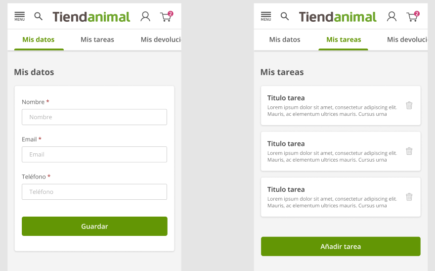

# TODO CRUD Application

A simple TODO application that uses the latest technologies and best practices.

## Demo

Check out the live demo: <a href="https://galiprandi.github.io/tiendanimal" target="_blank">galiprandi.github.io/tiendanimal</a>



## Features

- 📄 **Paginated TODO List**: View a list of TODOs fetched from the REST API.
- ⚡ **Optimistic Updates**: Enhance user experience with immediate UI updates when creating or deleting TODOs.
- ➕ **Add TODOs**: Seamlessly add new TODOs with optimistic updates.
- ❌ **Delete TODOs**: Effortlessly delete existing TODOs with optimistic updates.
- 🚫 **Error Handling**: Robust error handling and form validation.
- 🌐 **Internationalization**: Support for multiple languages (EN/ES).
- 🧪 **Unit Testing**: Comprehensive unit tests for components and hooks.
- 🛠️ **Git Hooks**: Automated tests run before each commit.
- 🔔 **Notifications**: Toast notifications for error messages.
- 🌐 **Resilience to Intermittent Connectivity**: The app gracefully handles intermittent network connectivity.

## Tech Stack

This project leverages the following technologies:

- **Vite**: A fast build tool for modern web development.
- **React**: A JavaScript library for building user interfaces with components.
- **i18next**: An internationalization framework for React, supporting multiple languages (EN/ES).
- **TypeScript**: A typed superset of JavaScript that enhances tooling and type safety.
- **Axios**: A promise-based HTTP client for making API requests.
- **TanStack Query**: A powerful data-fetching and state management library for server-state in React.
- **Vitest**: A unit testing framework designed for speed and simplicity.
- **Husky**: A tool for managing Git hooks to ensure tests run before commits.
- **Best Practices**: Follows best practices for React development, including hooks, functional components, and more.

## Installation

1. **Clone the repository:**

   ```bash
   git clone git@github.com:galiprandi/tiendanimal.git
   cd tiendanimal
   ```

2. **Install dependencies:**

   Make sure you have [Node.js](https://nodejs.org/) installed, then run:

   ```bash
   npm i
   ```

3. **Run the application:**

   Start the development server:

   ```bash
   npm run dev
   ```

4. **Run tests:**

   To run the unit tests, execute:

   ```bash
   npm run test:dev
   ```

## App Requirements

See en this file: [Requirements.md](./Requirements.md)

## Author

- **Germán Aliprandi**
  - LinkedIn: [linkedin.com/in/galiprandi](https://www.linkedin.com/in/galiprandi)
  - GitHub: [github.com/galiprandi](https://github.com/galiprandi)
  - Email: galiprandi@gmail.com
